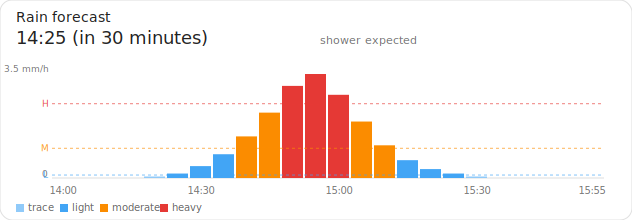

# BuienAlarm Card

[](https://github.com/hacs/integration)
[](LICENSE)

A Lovelace card for Home Assistant that visualises the rain forecast from
the [`ha-buienalarm`](https://github.com/lancer73/ha-buienalarm) integration.
Shows the next-shower headline, a coloured precipitation chart, and three
threshold lines (light / moderate / heavy).



> **Disclaimer.** This is an unofficial community card. It is not affiliated
> with or endorsed by BuienAlarm.

## Requirements

- Home Assistant 2024.12 or newer
- The [`ha-buienalarm`](https://github.com/lancer73/ha-buienalarm)
  integration installed and configured (this card reads its sensors)

## Installation

### Method 1 — HACS (recommended)

1. Make sure [HACS](https://hacs.xyz/) is installed.
2. In HACS, open the menu (top right) → *Custom repositories*.
3. Add `https://github.com/lancer73/lovelace-buienalarm-card` with category
   *Dashboard*.
4. Search for *BuienAlarm Card* in the HACS store and install it.
5. HACS adds the resource entry automatically — no manual step needed.
6. Hard-refresh your browser (Ctrl-Shift-R / Cmd-Shift-R).

### Method 2 — Manual

1. Copy `buienalarm-card.js` from this repository into
   `<config>/www/buienalarm-card.js`.
2. Add a Lovelace resource entry:
   - *Settings → Dashboards → ⋮ menu → Resources → Add resource*
   - URL: `/local/buienalarm-card.js?v=1`
   - Type: *JavaScript module*
3. Hard-refresh your browser.

## Usage

### Visual editor

Edit any dashboard, *Add card*, search "BuienAlarm Card" in the Custom
section. The visual editor exposes (top to bottom):

- **Title** — text shown above the headline
- **Next shower sensor** — the integration's status sensor (required)
- **Show headline** + **Color bars** — two checkboxes
- **Light / Moderate / Heavy** — three sensor pickers for the threshold
  values

### YAML

The minimal config:

```yaml
type: custom:buienalarm-card
next_shower_sensor: sensor.buienalarm_next_shower
```

A complete config:

```yaml
type: custom:buienalarm-card
title: Rain forecast
next_shower_sensor: sensor.buienalarm_next_shower
show_headline: true
color_bars: true
light: sensor.buienalarm_light_threshold
moderate: sensor.buienalarm_moderate_threshold
heavy: sensor.buienalarm_heavy_threshold
```

## Configuration options

| Option               | Type             | Default            | Description                                                            |
|----------------------|------------------|--------------------|------------------------------------------------------------------------|
| `type`               | string           | —                  | Required — must be `custom:buienalarm-card`                            |
| `next_shower_sensor` | entity           | —                  | **Required.** The integration's `next shower` sensor                   |
| `title`              | string           | `"Rain forecast"`  | Title shown at the top of the card; set to `""` to hide                |
| `show_headline`      | boolean          | `true`             | Show the human-readable status line below the title                    |
| `color_bars`         | boolean          | `true`             | Colour-code precipitation bars by intensity band                       |
| `light`              | entity or number | —                  | Light-rain threshold in mm/h, as a sensor or a fixed number            |
| `moderate`           | entity or number | —                  | Moderate-rain threshold in mm/h, as a sensor or a fixed number         |
| `heavy`              | entity or number | —                  | Heavy-rain threshold in mm/h, as a sensor or a fixed number            |

The `light`, `moderate`, and `heavy` options accept **either** an entity ID
(typically the integration's threshold sensors) **or** a fixed number. The
visual editor only exposes the entity picker; to configure a fixed number,
switch to the YAML editor:

```yaml
type: custom:buienalarm-card
next_shower_sensor: sensor.buienalarm_next_shower
light: 0.1
moderate: 1.0
heavy: 2.5
```

When a value isn't set, the corresponding threshold line and colour band
are simply not drawn.

## How it works

The card reads the `rain_forecast` attribute from the next-shower sensor.
The integration populates that attribute with a list of `{precip, attime}`
points covering the forecast window.

- **Headline** shows the sensor's state (e.g. `14:25 (in 30 minutes)`)
  with a sub-line derived from the `period_type` attribute.
- **Bars** plot precipitation in mm/h; their colour reflects which threshold
  band the value falls into (`trace`, `light`, `moderate`, `heavy`).
- **Dashed lines** mark the three thresholds; labels `L` / `M` / `H` sit
  in the left margin.
- **Y-axis** auto-scales to `max(heavy × 1.2, observed peak, 0.5)` so the
  chart still has shape on dry days.

## Localisation

The card translates its own UI (default title, period sub-text, editor
labels, legend, error and empty states) into the same set of languages
the `ha-buienalarm` integration supports:

`en`, `nl`, `fr`, `es`, `pt`, `pt-br`, `fy`, `tr`, `ar`, `de`, `de-ch`.

Language is picked from `hass.locale.language` (the user's Home Assistant
UI language). Lookup is case-insensitive and falls back to the base
language (`de-CH` → `de`) and then to English. Unknown locales fall back
to English.

Two notes on what is **not** controlled by the HA UI language:

- The next-shower **state value itself** (e.g. `over 30 minuten` /
  `in 30 minutes`) is rendered server-side by the integration and follows
  its own `language` config option, set when you configure the
  integration. The card displays that value as-is.
- Entity *names* (the labels Home Assistant shows for each sensor) follow
  the HA UI language via the integration's `translations/*.json` files,
  not the card.

Native-speaker corrections are welcome — open a PR against
`buienalarm-card.js`; the strings live in the `TRANSLATIONS` object near
the top of the file.

## Privacy

- No external network calls. The card reads exclusively from the local
  Home Assistant state object.
- No browser storage (`localStorage`, `sessionStorage`, cookies) is used.
- All user-supplied values are HTML-escaped before being inserted into
  the DOM.
- No analytics, no telemetry, no tracking.

## Troubleshooting

- **"Custom element doesn't exist: buienalarm-card"** — the resource isn't
  loaded. Check *Settings → Dashboards → Resources* and verify the URL is
  reachable; hard-refresh the browser (Ctrl-Shift-R).
- **Card editor shows blank fields** — close and reopen the editor. If
  it persists, hard-refresh; you may have a cached older version.
- **Chart shows "No forecast data available yet"** — the integration
  hasn't done its first refresh, or the configured sensor isn't the
  integration's status sensor (it must expose a `rain_forecast` attribute).
  Check *Developer tools → States* for the sensor.
- **Threshold lines missing** — the configured threshold sensor returned
  `unknown` / `unavailable` or wasn't set. Either fill the field or use a
  fixed number.
- **Card logs `BUIENALARM-CARD vX.Y.Z` on every dashboard refresh** —
  that's expected; the message confirms the module loaded.

If you find a bug, open an issue with the browser console output and
the YAML configuration of the card.

## Compatibility

- **Home Assistant**: 2024.12 or newer
- **Browsers**: Tested on current Chromium and Firefox; Safari is expected
  to work but is not actively tested
- **Mobile**: The chart scales to the available card width

## Related projects

- [`ha-buienalarm`](https://github.com/lancer73/ha-buienalarm) — the
  Home Assistant integration this card visualises

## License

This project is licensed under the MIT License — see the [`LICENSE`](LICENSE)
file for details.

The BuienAlarm name and any official trademarks belong to their respective
owners. This card is an unofficial visualisation tool for a community
integration.
